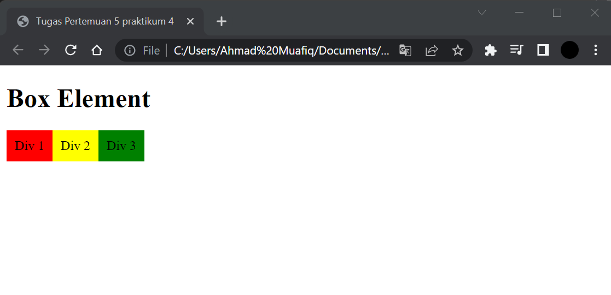
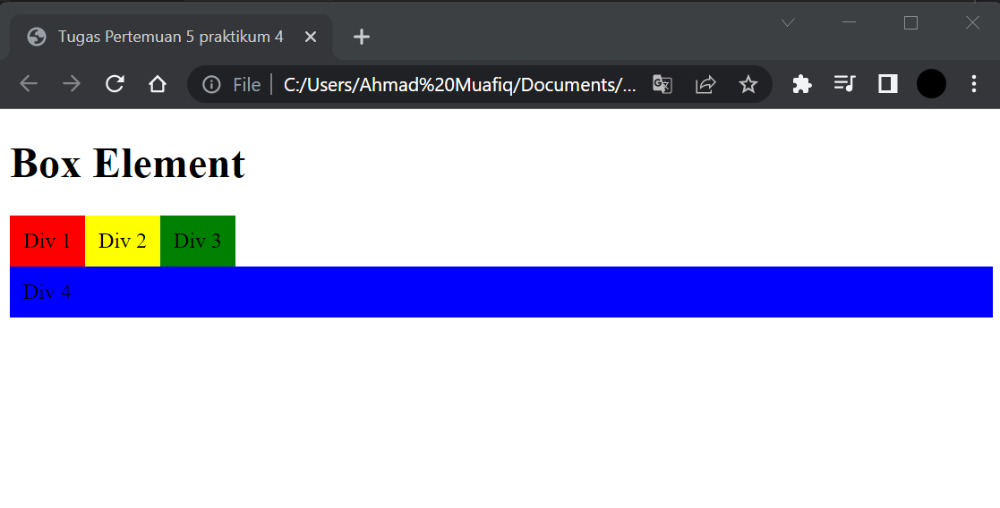
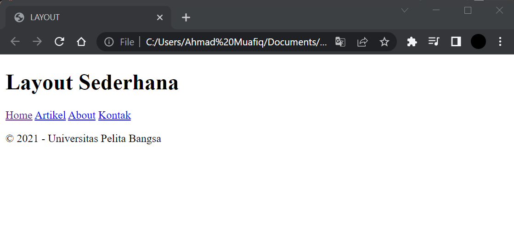

# Lab4Web
## Tugas Pemograman Web - pertemuan 5 Praktikum 4

<table border="1" cellpadding="6" cellspacing="2">
            <thead>
            <tr>
            <th>Nama </th>
            <th>Ahmad Muafiq</th>
            </tr>
            </thead>
            <tbody>
            <tr>
            <td>NIM </td>
            <td >312010152</td>
            </tr>
            <tr>
            <td>Kelas </td>
            <td>TI.20.B1</td>
            </tbody>
            </table>

1. Membuat Box Element dan CSS Float Property.

<i>Dilangkah awal ini kita membuat membuat box element dengan tag div dan CSS float property digunakan untuk membuat layout web dan mudah menentukan posisi atau letak sebuah elemen HTML.</i>

2. Mengatur Clearfix Element.

<i>Untuk yang selanjutnya Clearfix ini digunakan untuk mengatur element setelah float element. Property clear digunakan untuk mengaturnya. berikut tampilanya.</i>

3. Layout Sederhana.

<i>selanjutnya disini kita membuat layout senderhana yaitu kerangka yang mengatur penempatan tata letak sebuah elemen pada halaman web. Tata letak element seperti navigasi, header, tombol CTA (Call to Action), dan elemen lainnya pada halaman web, sehingga tampilan web dapat disesuaikan dengan desain yang ada.</i>

